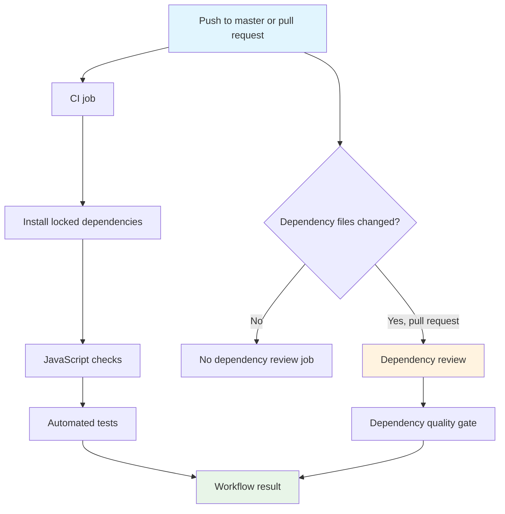

# Workflow Overview

**Purpose**: Validate Tommy’s Club code and dependency changes before they reach the `master` branch.

**Trigger events**:

- Push to `master`.
- Pull request targeting `master`.
- Dependency review runs only when `package.json` or `package-lock.json` changes in a pull request.

**Target environments**: GitHub-hosted Ubuntu runners only. The workflows do not deploy, access production services, or modify Supabase.

## Execution Flow



## Jobs and Dependencies

| Job | Purpose | Dependencies | Execution context |
| --- | --- | --- | --- |
| `check-and-test` | Install locked packages, validate JavaScript, and run tests | None | Ubuntu runner with Node.js 22.x |
| `dependency-review` | Detect high-severity vulnerabilities introduced by dependency changes | Pull request with dependency-file changes | Ubuntu runner with read-only repository access |

Jobs are independent. A pull request must pass every job that is created for its changed files.

## Requirements Matrix

### Functional requirements

| ID | Requirement | Priority | Acceptance criteria |
| --- | --- | --- | --- |
| REQ-001 | CI runs for pushes to `master` | High | A push creates a CI workflow run. |
| REQ-002 | CI runs for pull requests targeting `master` | High | A pull request receives a CI status check. |
| REQ-003 | CI uses Node.js 22.x | High | The runner reports the configured Node.js 22 version. |
| REQ-004 | CI uses the lockfile as the dependency source | High | Installation uses `npm ci` and fails on lockfile drift. |
| REQ-005 | CI runs project checks and tests | High | `npm run check` and `npm test` both complete successfully. |
| REQ-006 | Dependency review inspects dependency changes | High | A dependency-changing pull request receives a review result. |

### Security requirements

| ID | Requirement | Implementation constraint |
| --- | --- | --- |
| SEC-001 | Workflows use least-privilege repository access | Default job permissions are limited to `contents: read`. |
| SEC-002 | Production credentials never enter CI | No Supabase, ImageKit, Vercel, session, admin, or `.env` values are configured. |
| SEC-003 | Third-party actions are version-pinned | Use maintained major versions; never use `@latest`. |
| SEC-004 | Dependency vulnerabilities can block review | Dependency review fails at high severity or above. |

### Performance requirements

| ID | Metric | Target | Measurement |
| --- | --- | --- | --- |
| PERF-001 | CI duration | 10 minutes or less | Job timeout and GitHub Actions runtime. |
| PERF-002 | Duplicate in-flight runs | At most one active run per workflow/ref | Concurrency cancellation. |

## Input and Output Contracts

### Inputs

```yaml
node_version: 22.x
production_branch: master
dependency_files:
  - package.json
  - package-lock.json
commands:
  - npm ci
  - npm run check
  - npm test
```

### Outputs

```yaml
ci_status: success | failure | cancelled
dependency_review_status: success | failure | skipped
```

The workflows produce status checks and logs only. They do not publish artifacts or modify repository files.

### Secrets and variables

| Type | Name | Purpose | Scope |
| --- | --- | --- | --- |
| None | None | These workflows do not require secrets. | Workflow |

## Execution Constraints

### Runtime constraints

- Ubuntu GitHub-hosted runner.
- Node.js 22.x.
- Maximum job duration: 10 minutes.
- Concurrent runs for the same workflow/ref are cancelled in favor of the newest run.

### Environmental constraints

- Network access is limited to package installation and GitHub Actions services.
- No application server startup is required.
- No Supabase or ImageKit connection is permitted.
- No database migration is run.

## Error Handling Strategy

| Error type | Response | Recovery action |
| --- | --- | --- |
| Dependency installation failure | CI fails | Inspect lockfile or package registry output; rerun after correction. |
| Syntax/check failure | CI fails | Fix the reported JavaScript issue and push an update. |
| Test failure | CI fails | Reproduce locally with `npm test`, then correct the regression. |
| High-severity dependency finding | Dependency review fails | Upgrade, replace, or explicitly investigate the dependency before merging. |
| Runner or network interruption | Workflow may fail or cancel | Rerun after confirming the repository change is unchanged. |

## Quality Gates

| Gate | Criteria | Bypass conditions |
| --- | --- | --- |
| Code validation | `npm run check` succeeds | None for normal merges. |
| Automated tests | `npm test` succeeds | None for normal merges. |
| Dependency security | No newly introduced high-or-critical vulnerability | Maintainer review may adjust the threshold through a documented workflow change. |

The checks should be configured as required branch-protection status checks after the initial rollout is stable.

## Monitoring and Observability

- GitHub Actions logs are the source of diagnostic output.
- Workflow success and failure are visible in the repository Actions tab.
- Pull requests display each applicable status check.
- Maintainers should review repeated failures for flaky tests, dependency drift, or runner changes.

## Integration Points

| System | Integration | Data exchanged |
| --- | --- | --- |
| GitHub repository | Push and pull request events | Commit metadata and source files |
| npm registry | Locked dependency installation | Package archives listed by the lockfile |
| GitHub Advisory Database | Dependency review | Dependency vulnerability metadata |

Future integrations:

- CodeQL for JavaScript/Node.js analysis after CI is stable.
- Dependabot for scheduled dependency update pull requests after CI is stable.

## Compliance and Governance

- Keep workflow permissions read-only unless a later workflow has a documented reason to require more access.
- Do not add production secrets to CI for ordinary checks.
- Review action major-version updates as repository changes.
- Update this specification before changing workflow behavior.
- Require successful CI and dependency review before merging to `master` once branch protection is enabled.

## Edge Cases

| Scenario | Expected behavior | Validation |
| --- | --- | --- |
| Documentation-only pull request | CI runs; dependency review is skipped if dependency files are unchanged | Open a documentation-only pull request. |
| `package.json` changes without lockfile update | `npm ci` fails | Create a temporary lockfile-drift change locally. |
| Unsupported Node.js syntax | `npm run check` fails | Add a temporary syntax error and confirm the job fails. |
| Test regression | `npm test` fails | Add a temporary failing assertion and confirm the job fails. |
| Dependency introduces high vulnerability | Dependency review fails | Test with a controlled dependency update in a temporary branch. |
| Fork pull request | Checks run without production credentials | Open a pull request from a fork. |

## Validation Criteria

- **VLD-001**: Both workflow files parse as valid GitHub Actions YAML.
- **VLD-002**: CI triggers only on `master` pushes and pull requests targeting `master`.
- **VLD-003**: Dependency review triggers only for dependency-file changes in pull requests.
- **VLD-004**: No workflow references production credentials or application secrets.
- **VLD-005**: `npm ci`, `npm run check`, and `npm test` pass locally.
- **VLD-006**: `git diff --check` passes.

## Change Management

1. Update this specification when workflow behavior changes.
2. Review the proposed workflow change in a pull request.
3. Validate YAML and run the local project checks.
4. Confirm the workflow on a test pull request.
5. Update branch protection requirements only after the checks are stable.

### Version history

| Version | Date | Change | Author |
| --- | --- | --- | --- |
| 1.0 | 2026-07-18 | Initial CI and dependency-review specification | Tommy's Club Maintainers |

## Related documentation

- [`README.md`](../README.md) — contributor setup and local verification.
- [`ISSUES.md`](../ISSUES.md) — project fix and improvement checklist.
- [GitHub Node.js Actions guide](https://docs.github.com/en/actions/tutorials/build-and-test-code/nodejs).
- [GitHub dependency review](https://docs.github.com/en/code-security/how-tos/secure-your-supply-chain/manage-your-dependency-security/configure-dependency-review-action).
